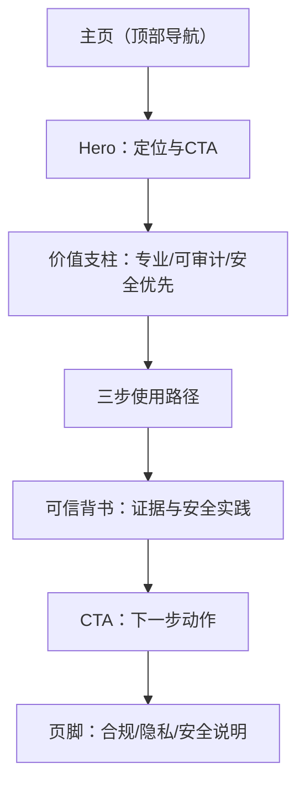

## 1. Product Overview
一个高审美的品牌主页，用清晰结构传达“专业 / 可审计 / 安全优先”，并用“三步使用路径”引导你快速理解与行动。
目标是让你在 30 秒内理解价值、在 2 分钟内完成下一步转化（联系 / 预约 / 开始使用）。

## 2. Core Features

### 2.1 Feature Module
该站点的需求由以下页面构成：
1. **主页**：品牌主视觉与核心价值主张、三步使用路径、可信背书（合规/审计/安全）、行动号召与页脚信息。

### 2.2 Page Details
| Page Name | Module Name | Feature description |
|-----------|-------------|---------------------|
| 主页 | 顶部导航 | 提供站点名称/Logo、核心锚点导航（价值主张/三步路径/可信背书/行动号召）。 |
| 主页 | Hero 主视觉 | 强调“专业/可审计/安全优先”的一句话定位；展示关键卖点与主按钮/次按钮。 |
| 主页 | 价值支柱（3 列） | 解释三大关键词含义（专业/可审计/安全优先），各自给出一句价值描述与可验证点。 |
| 主页 | 三步使用路径 | 用 3 个步骤解释使用路径（从接入到验证再到上线/运行），提供每步目标、输入/输出与预计耗时。 |
| 主页 | 可信背书区 | 展示可审计证据类型（日志、变更记录、导出报告等）与安全实践要点（最小权限、加密、隔离等）。 |
| 主页 | 行动号召（CTA） | 在页面中部与底部重复出现：引导你进行下一步动作（例如“获取方案/预约演示/开始评估”）。 |
| 主页 | 页脚 | 提供版权信息与必要链接占位（例如条款/隐私/安全说明）。 |

## 3. Core Process
- 你的浏览流程：进入主页 → 快速扫描 Hero 了解定位 → 查看三大价值支柱确认是否匹配 → 阅读“三步使用路径”理解落地方式 → 在可信背书区确认“可审计/安全”证据 → 点击 CTA 进入下一步动作。

