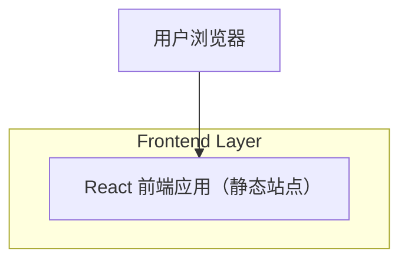

## 1.Architecture design

## 2.Technology Description
- Frontend: React@18 + tailwindcss@3 + vite
- Backend: None

## 3.Route definitions
| Route | Purpose |
|-------|---------|
| / | 主页，展示定位信息、三步使用路径、可信背书与 CTA |

## 6.Data model(if applicable)
不需要数据库（当前需求仅为展示型主页）。